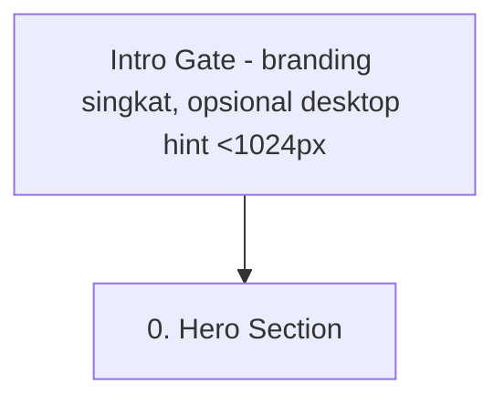

# Desktop Intro Gate — New Feature Patch (Patch untuk prd.md §2.1, wireframe-handoff.md §2.2, user-flow-ia.md)

> **Status:** New Patch | **Date:** July 16, 2026
> **Repository:** ryama-dev

## Konteks
Pengalaman inti situs ini (scroll choreography GSAP, split layout lebar hasil patch `12_desktop_priority_layout_patch.md`, canvas 3D mockup) dirancang untuk desktop. Di layar kecil, sebagian nuansa itu otomatis disederhanakan (stacked layout, dsb) — situs tetap berfungsi penuh, tapi tidak menyampaikan pengalaman yang paling optimal.

Ditambahkan satu momen singkat sebelum Hero utama muncul, yang menyampaikan hal ini secara halus — bukan popup/modal yang mengganggu, konsisten dengan prinsip Editorial Minimalis yang sudah berlaku di seluruh situs.

**Penempatan:** ini bagian dari initial load (muncul sebelum Hero, lalu fade out ke Hero) — BUKAN section ke-0 yang ikut di-scroll seperti section lain di homepage.

## ⚠️ Asumsi yang saya ambil — tolong dikoreksi kalau salah arah
Saya asumsikan pesan "buka di desktop" ini **hanya relevan ditampilkan ke pengunjung yang sedang membuka di layar < breakpoint Laptop (1024px)** — kalau pengunjung sudah di desktop, menyuruh mereka "buka di desktop" jadi tidak relevan. Jadi:
- **Semua pengunjung** (device apapun) tetap melihat momen intro branding singkat (wordmark muncul).
- **Hanya viewport <1024px** yang melihat baris tambahan saran buka di desktop.

Kalau maksud kamu pesan itu tetap mau ditampilkan ke semua device (termasuk yang sudah desktop), tinggal bilang — tinggal hapus kondisional viewport-nya, sisanya sama.

## Trigger & Durasi
- Muncul sekali per sesi browser (pakai `sessionStorage`, key semacam `introSeen`) — tidak muncul ulang kalau reload/navigasi di tab yang sama, tapi muncul lagi di sesi/tab baru.
- Auto-advance ke Hero setelah **±1.8–2.2 detik**.
- Bisa di-skip kapan saja dengan klik/tap/scroll — tidak ada tombol "Lanjutkan"/"Skip" eksplisit (menghindari elemen UI tambahan yang bertentangan dengan prinsip minimalis situs).
- Menghormati `prefers-reduced-motion` (constraint global, sudah ada di `prd.md` §5) — kalau aktif, animasi entrance di-skip tapi pesan tetap sempat tampil sebentar sebelum fade cepat ke Hero (bukan dihilangkan total).

## Visual & Konten
Semua elemen memakai token yang sudah ada di `design-system.md` — tidak ada token/warna baru diperkenalkan.

- **Background:** `bg` (`#EEEDE9`), sama seperti Hero.
- **Wordmark "RYAMA":** serif Playfair Display, treatment sama seperti wordmark besar yang sudah ada di Hero saat ini (centered, solid charcoal). Animasi masuk: fade + scale halus lewat GSAP — konsisten dengan penggunaan GSAP untuk entrance animation di bagian lain situs (lihat `10_case_study_layout.md`). **Bukan** spinner/loading bar/progress indicator — tidak sesuai prinsip editorial-minimalis situs ini.
- **[Kondisional, viewport <1024px]** baris kecil di bawah wordmark, muncul dengan stagger delay (bukan barengan dengan wordmark):
  - Font: Space Grotesk (body font)
  - Warna: `text-muted`
  - Contoh copy: *"Untuk pengalaman terbaik, buka di layar desktop"*
- Custom cursor (instant-follow, charcoal, sudah ada di `design-system.md` §3.2) tetap aktif di layar ini — tidak butuh state kursor baru.

## Catatan Implementasi
- Karena kondisional viewport (<1024px) butuh deteksi di client-side, ada kemungkinan flash sesaat sebelum JS jalan (baris pesan muncul terlambat beberapa milidetik). Ini keputusan teknis yang bisa didetailkan saat eksekusi (misal pakai CSS media query untuk initial hidden state), bukan bagian dari spec desain di patch ini.
- Gate ini render sebelum/di atas komponen Hero — pilihan pendekatan (render terpisah vs overlay di atas Hero yang sudah di-mount) diserahkan ke implementasi.

## Update ke Dokumen Lain

**`user-flow-ia.md`** — tambahkan node baru sebelum Hero di diagram utama:

**`prd.md` §2.1** — tambahkan satu baris di awal deskripsi Homepage: *"Sebelum Hero, ada momen intro singkat (lihat `13_desktop_intro_gate_patch.md`) yang fade otomatis ke Hero."*

**`wireframe-handoff.md` §2.2** — tambahkan catatan bahwa Hero Section (100vh, murni tipografi) sekarang didahului oleh Intro Gate, bukan langsung jadi tampilan pertama yang di-load.

## Yang TIDAK berubah
- Hero Section itu sendiri (isi, tipografi, tanpa imagery) tetap persis seperti spesifikasi lama — patch ini cuma menambah momen SEBELUM Hero, tidak mengubah Hero.
- Tidak ada perubahan ke navigasi/IA lain di luar penambahan satu node ini.
