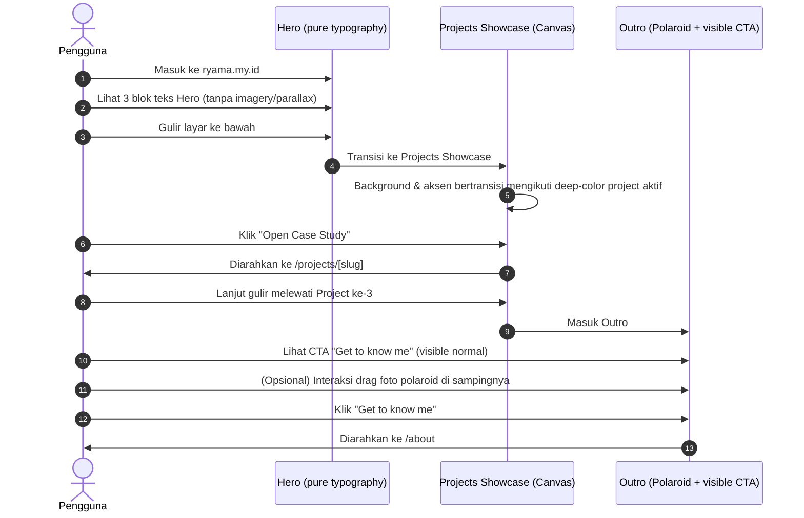
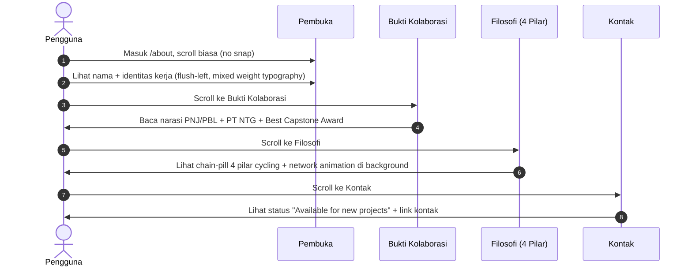

# User Flow & Information Architecture — ryama.my.id

> **Status:** Revised | **Date:** July 15, 2026
> **Repository:** ryama-dev

---

## 1. Information Architecture (IA) / Peta Situs

```mermaid
graph TD
    R[Root Route: /]
    H[0. Hero Section - pure typography, no imagery]
    P1[1. Project 1: Predictive Maintenance]
    P2[2. Project 2: Interview Assessment System]
    P3[3. Project 3: Mail Reader]
    O[4. Outro - visible CTA + Draggable Polaroid Stack]

    A[About Route: /about - normal scroll, no snap]
    AS1[1. Pembuka]
    AS2[2. Cerita Personal]
    AS3[3. Bukti Kolaborasi]
    AS4[4. Filosofi - 4 Pilar Chain]
    AS5[5. Tech Stack Tags]
    AS6[6. Kontak / Penutup]

    CS[Case Study Route: /projects/slug]

    R --> H
    H --> P1
    P1 --> P2
    P2 --> P3
    P3 --> O

    R -- Floating Nav --> A
    A --> AS1
    AS1 --> AS2
    AS2 --> AS3
    AS3 --> AS4
    AS4 --> AS5
    AS5 --> AS6

    P1 -- Click CTA --> CS
    P2 -- Click CTA --> CS
    P3 -- Click CTA --> CS

    O -- Click "Get to know me" --> A
    CS -- Click Back Link --> R
```

**Perubahan dari draft sebelumnya:**
- About page (AS1-AS6) sepenuhnya direvisi — bukan lagi bento-slide snap, tapi normal scroll dengan struktur konten baru (lihat §3 di bawah).
- Outro CTA sekarang eksplisit "visible" di diagram — bukan tersembunyi di balik photo stack.

### Aturan Rute & Redirection
- `GET /projects` (tanpa slug) redirect otomatis ke `GET /` — showcase project menempel di homepage, bukan halaman terpisah.
- `GET /projects/[slug]` (dengan slug) adalah halaman detail case study yang valid, TIDAK ikut redirect.
- `/about`: tautan kiri atas "← Portfolio" → `/`.
- `/projects/[slug]`: tautan kiri atas "← Back to projects" → `/`.
- ⚠️ **PENDING:** `caseStudyUrl` per project di `lib/projects.ts` saat ini masih mengarah ke GitHub eksternal di production — perlu diganti ke `/projects/[slug]` internal setelah case study page siap.

---

## 2. Key User Flows

### 2.1 Menjelajahi Proyek via Scroll (Alur Utama)



### 2.2 Menjelajahi About Page (Alur Baru)



---

## 3. Responsive Navigation Adaptations

### 3.1 Landscape Mode (Desktop/Tablet Mendatar)
- **Homepage:** Layout 2 kolom terkunci (pinning scroll).
- **About Page:** Normal scroll vertikal — **TIDAK ADA `snap-y snap-mandatory`** (berbeda dari draft lama).

### 3.2 Portrait Mode (Mobile/Tablet Tegak)
- **Homepage:** Stacked (teks atas, media bawah).
- **About Page:** Sudah normal scroll dari awal — tidak perlu penonaktifan snap khusus mobile (karena desktop juga sudah normal scroll).